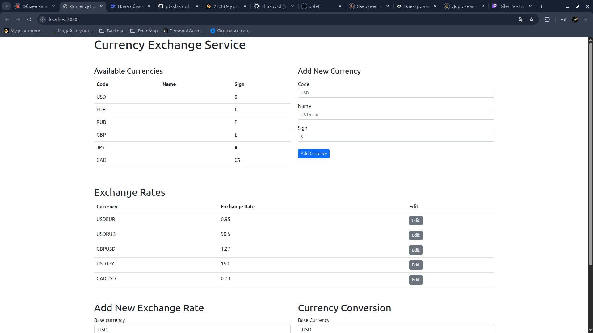

# Currency Exchange API

REST API для работы с валютами и обменными курсами. Позволяет просматривать, создавать и редактировать валюты и курсы, а также конвертировать произвольные суммы из одной валюты в другую.

---

# Currency Exchange API (EN)

REST API for currencies and exchange rates. Supports viewing, creating, and editing currencies and rates, as well as converting arbitrary amounts between currencies.

---

## 🛠 Стек технологий / Tech Stack

- **Java 17**
- **Jakarta Servlet API 6.0** — без фреймворков / no frameworks
- **SQLite** — встроенная БД / embedded database
- **JDBC** — работа с БД / database access
- **Jackson** — сериализация JSON / JSON serialization
- **SLF4J + Logback** — логирование / logging
- **Maven** — сборка / build tool
- **Apache Tomcat 10** — сервер приложений / application server

---

## ✨ Функционал / Features

**🇷🇺**
- Просмотр списка валют и отдельных валют по коду
- Добавление новых валют
- Просмотр списка обменных курсов и курсов по валютной паре
- Создание и обновление обменных курсов
- Конвертация суммы из одной валюты в другую по трём сценариям:
    - прямой курс
    - обратный курс
    - кросс-курс через USD

**🇬🇧**
- List all currencies and get a single currency by code
- Add new currencies
- List all exchange rates and get a rate by currency pair
- Create and update exchange rates
- Convert amounts between currencies using three scenarios:
    - direct rate
    - reverse rate
    - cross-rate via USD

---

## 📡 API Endpoints

| Method | URL | Description |
|--------|-----|-------------|
| `GET` | `/currencies` | Список всех валют / All currencies |
| `GET` | `/currency/{code}` | Одна валюта / Single currency |
| `POST` | `/currencies` | Создать валюту / Create currency |
| `GET` | `/exchangeRates` | Список всех курсов / All exchange rates |
| `GET` | `/exchangeRate/{pair}` | Один курс / Single rate (e.g. `USDEUR`) |
| `POST` | `/exchangeRates` | Создать курс / Create rate |
| `PATCH` | `/exchangeRate/{pair}` | Обновить курс / Update rate |
| `GET` | `/exchange?from=X&to=Y&amount=Z` | Конвертация / Convert |

### Примеры ошибок / Error Examples

```json
{ "message": "Валюта не найдена" }
```

**HTTP-коды:** `200`, `201`, `400`, `404`, `409`, `500`

---

## 📂 Структура проекта / Project Structure

```
src/main/java/com/boo4er/currencyexchange/
├── config/       — слушатели / listeners
├── dao/          — доступ к БД / data access
├── dto/          — Data Transfer Objects
├── exception/    — иерархия исключений / exceptions
├── filter/       — сервлет-фильтры / filters
├── model/        — модели данных / domain models
├── servlet/      — REST-контроллеры / servlets
└── util/         — утилиты / utilities
```

---

## 🚀 Как запустить локально / How to Run Locally

### Требования / Requirements

- Java 17+
- Maven 3.8+
- Apache Tomcat 10

### Шаги / Steps

**1. Клонировать репозиторий / Clone**
```bash
git clone https://github.com/ptkvlsk/currency-exchange.git
cd currency-exchange
```

**2. Собрать WAR / Build WAR**
```bash
mvn clean package
```

**3. Развернуть в Tomcat / Deploy to Tomcat**

Скопируйте `target/currency-exchange.war` в `<tomcat>/webapps/` и запустите Tomcat.

Copy `target/currency-exchange.war` to `<tomcat>/webapps/` and start Tomcat.

**4. Открыть в браузере / Open in browser**
```
http://localhost:8080/currency-exchange/
```

База данных SQLite создастся автоматически при первом запуске.
The SQLite database is created automatically on first launch.

---

## 📸 Скриншоты / Screenshots



> **Note:** Для визуального тестирования API подключён тестовый фронтенд от [Сергея Жукова](https://github.com/zhukovsd/currency-exchange-frontend).
> Backend полностью написан мной.
>
> **Note (EN):** The test frontend from [Sergey Zhukov](https://github.com/zhukovsd/currency-exchange-frontend) is used for API visual testing. The backend is fully my own work.

---

## 👤 Автор / Author

**ptkvlsk**

- GitHub: [@ptkvlsk](https://github.com/ptkvlsk)

Учебный проект в рамках курса [«Java Backend Learning Course»](https://zhukovsd.github.io/java-backend-learning-course/) Сергея Жукова.

Educational project based on [Sergey Zhukov's Java Backend Learning Course](https://zhukovsd.github.io/java-backend-learning-course/).

---

## 📄 Лицензия / License

Учебный проект. Свободен для использования в образовательных целях.
Educational project. Free to use for educational purposes.